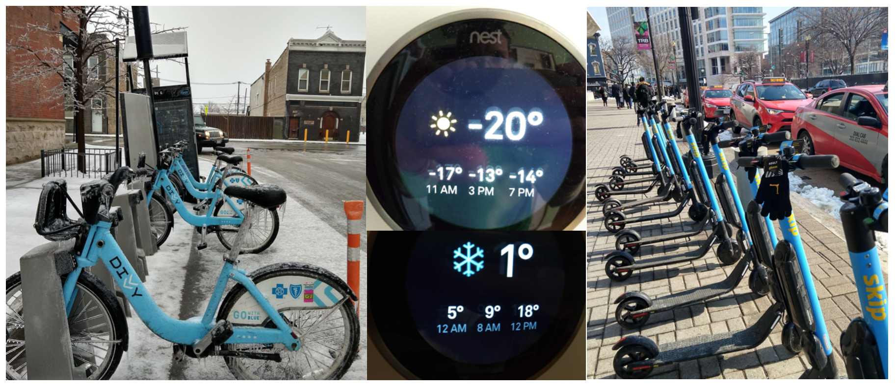
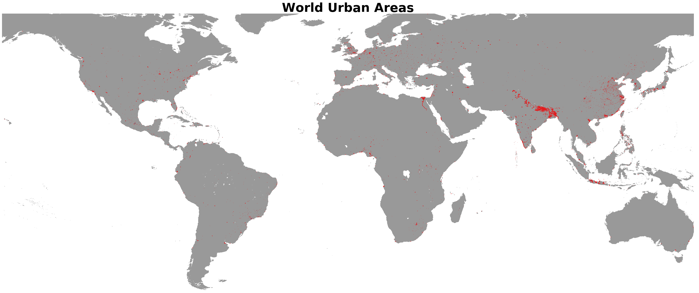
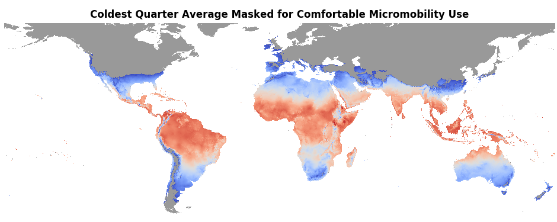
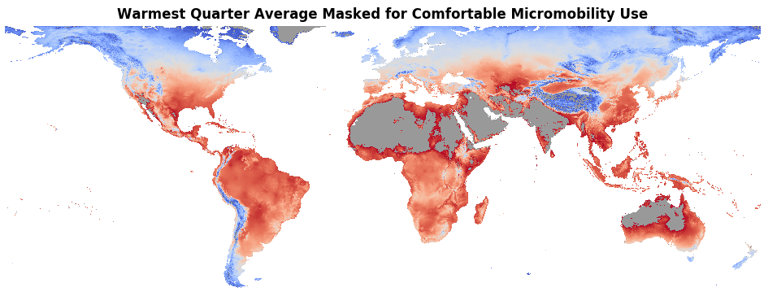
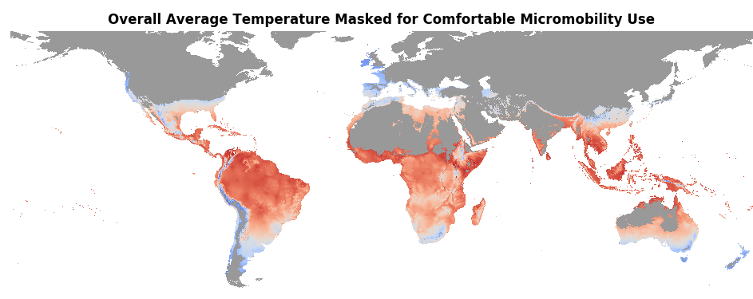
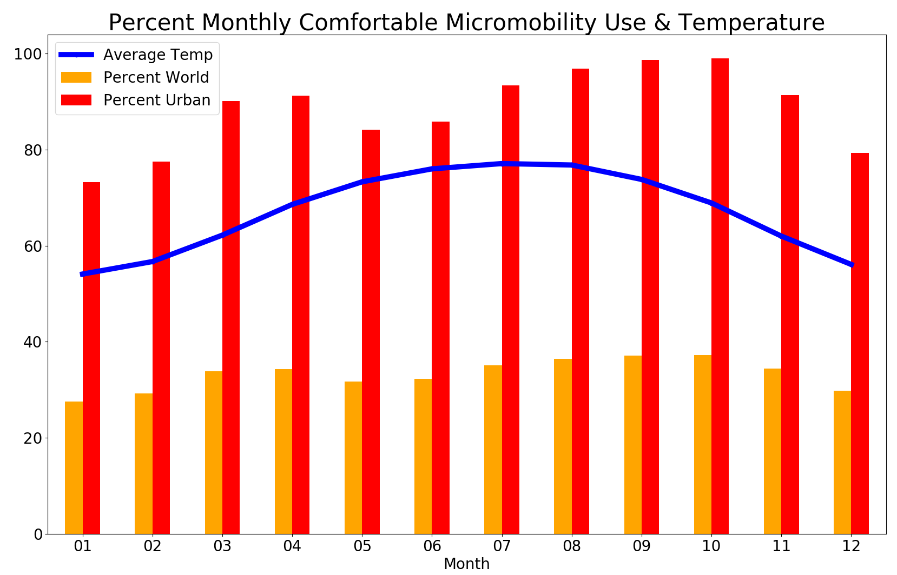

#Micromobility and Seasons
Published on March 11, 2019
Michael Haynes

Published on LinkedIn at: [https://www.linkedin.com/pulse/micromobility-seasons-michael-haynes/](https://www.linkedin.com/pulse/micromobility-seasons-michael-haynes/)

The micromobility revolution began a century ago with [bikes](https://en.wikipedia.org/wiki/History_of_the_bicycle) and more recently [scooters](https://en.wikipedia.org/wiki/Kick_scooter) and [Segways](https://en.wikipedia.org/wiki/Segway). In fact if you run a Google search for “[micromobility](https://www.google.com/search?q=micromobility)” and feel lucky you get: [Micro scooters](http://www.micro-mobility.com/) at a URL of none other than: [http://www.micro-mobility.com/](http://www.micro-mobility.com/) Of course these are all the rage in Europe and I even have two in my garage for my kids, both purchased in London actually! Of course London has the right climate to support nearly year round micromobility, more on this shortly as the thesis of the post. Recently, shared micromobility is exploding as cities adopt bike share and now see dockless bikes and scooters proliferating.

The shared micromobility movement now has [conferences](https://micromobility.io/), [articles](https://venturebeat.com/2018/06/09/why-micro-mobility-startups-wont-survive-as-standalone-services/), [blogs]https://medium.com/populus-ai/the-micro-mobility-revolution-95e396db3754, and a host of [buzz](https://www.citylab.com/transportation/2019/02/micromobility-conference-electric-scooters-bike-share/581791/), including a “[playbook](https://playbook.t4america.org/)”. As a proud annual member of [Divvy](https://www.divvybikes.com/) bikes here in Chicago for nearly five years, I can say that I am a card (fob perhaps? [TransitApp integration](https://transitapp.com/partners/bikeshare) really) carrying member of the innovation of shared micromobility. However, my last Divvy ride was months ago, due of course to the [brutal winter](https://weather.com/forecast/national/news/2019-01-28-polar-vortex-midwest-arctic-air-coldest-two-decades)s of Chicago putting a halt on my use of personal and shared micromobility. (Although, I will admit that I am more likely to use shared micromobility in poor weather than personal micromobility, the Divvy bike is a tank compared to my bike!)

Chicago Divvy, my home Nest reporting temperatures during the polar vortex, and Washington DC Skip scooters with sloppy slushy streets. 

###Population & Climate Analysis

Let us set about making some estimates of the population of the planet that can comfortably use shared micromobility. First, we need to look at urban areas as spaces that can support lightweight shared transportation. Some empirical (that is a brief visual wandering of the earth in [QGIS](https://www.qgis.org/en/site/) with the referenced datasets) exploration of data [1] shows that about 1,000 people per square kilometer is a [dense urban](http://www.newgeography.com/content/002808-world-urban-areas-population-and-density-a-2012-update) area and likely capable of supporting shared micromobility services. Essentially, about 38% of the population of the world [2] lives in at least a thousand person dense square-km. 

A second major factor affecting the utility of micromobility is the temperature or overall climate. A temperature of about 41°F (4.5°C) to 86°F (30°C) seems a reasonable average monthly temperature range to support outdoor micromobility use. Again, the range was empirically obtained, mostly by looking at some [urban temperature data](https://en.wikipedia.org/wiki/List_of_cities_by_average_temperature) and asking myself:
*“Would I likely ride in that city at that average temperature?”*
Important to note here is that much study is needed (and may already exist in some capacity) to calibrate, via stated preference surveys, a more precise temperature range. For example someone from Atlanta, GA likely will not touch a bike in 40°F (4.4°C) weather but someone in Chicago will easily consider biking at that temperature (especially after a long cold winter!). Likewise someone in Miami, FL will think nothing of biking in 95°F (35.6°C) weather but a Chicagoan will likely consider this too hot (of course dew points really matter in this determination!). Finally, the temperature ranges need to be further analyzed for isothermality effects as in the daily temperature range can dramatically affect the average temperature for a month. The effort presented is meant to merely open the discussion with some robust but rudimentary empirical analysis. Of course precipitation, wind and other meteorological effects (intense sun, UV index, heat index, wind chill, air quality, etc.) also can drastically affect the utility of micromobility transport.

The average temperature of the world [3] weighted by population is 67°F (19.5°C). Looking at just the warmest quarter and coldest quarter we get a range of 55°F (12.8°C) to 78°F (25.6°C) for overall worldwide weighted average temperature. 

###Results

A quick analysis of looking at the average warmest and coldest three month period of the year masked to cover areas likely uncomfortable for micromobility use is presented:

The percentage of the world that will find micromobility comfortable in the warmest quarter is 32% or 85% of those in urban areas. For cold months about 30% worldwide and 77% in urban areas will find micromobility comfortable.

Combining the two masks and displaying the overall annual average temperature produces the following map which depicts locations where year-round micromobility is likely comfortable:

*23% of the world, 62% of urban areas, support year-round micromobility.*
A deeper analysis of average monthly temperatures allows us to animate the year as shown:

We can then plot the monthly data and see that September and October are the best months for urban area micromobility:

###Thoughts & Future Direction

The brief analysis presented here is meant to spark discussion and to locate or spur rigorous academic and industry research on the effects of the climate of a region on micromobility and ultimately shared micromobility. A logical next step (perhaps an update to this post soon) is to look at [Divvy Ridership numbers](https://www.divvybikes.com/system-data) across the months and comparing with temperature averages. One can even get daily temperature readings and weather conditions to more finely analyze the effects.  

I strongly encourage some discussion here or references to other climate and micromobility stated preference work, and I welcome the opportunity to run some analysis and contribute to the conversation.

##Code Notes:
Code to create the charts posted as a GitHub project.  
Whole process in Python3 on an SSD Macbook takes just under four minutes to run and maxes out at about 14GB of RAM use.  

Python Script: [pop_climate.py](pop_climate.py)
iPython Notebook: [pop_climate-splitcells.ipynb](pop_climate-splitcells.ipynb)

*Create Monthly Chart Video:*
`ffmpeg -framerate 1/2 -i avgtemp-%02d-mask.png -c:v libx264 -r 30 -pix_fmt yuv420p out.mp4`
`ffmpeg -i out.mp4 -filter:v "crop=940:390:150:390" -c:a copy AverageMonthlyTempMasked.mp4`
Might have to play with the cropping values a bit to get it correct!

###Data References:

[1] Center for International Earth Science Information Network - CIESIN - Columbia University. 2018. Gridded Population of the World, Version 4 (GPWv4): Population Density, Revision 11. Palisades, NY: NASA Socioeconomic Data and Applications Center (SEDAC). [https://doi.org/10.7927/H49C6VHW](https://doi.org/10.7927/H49C6VHW). Accessed 07 Mar 2019 2015 GeoTiff data at 2.5 Minute resolution
[2] Center for International Earth Science Information Network - CIESIN - Columbia University. 2018. Gridded Population of the World, Version 4 (GPWv4): Population Count, Revision 11. Palisades, NY: NASA Socioeconomic Data and Applications Center (SEDAC). [https://doi.org/10.7927/H4JW8BX5](https://doi.org/10.7927/H4JW8BX5). Accessed 07 Mar 2019 2015 GeoTiff data at 2.5 Minute resolution
[3] Fick, S.E. and R.J. Hijmans, 2017. Worldclim 2: New 1-km spatial resolution climate surfaces for global land areas. International Journal of Climatology  [http://worldclim.org/version2](http://worldclim.org/version2) Accessed 08 Mar 2019 2015 dataset at 2.5d resolution #1, #10, #11 files used
[4] Fick, S.E. and R.J. Hijmans, 2017. Worldclim 2: New 1-km spatial resolution climate surfaces for global land areas. International Journal of Climatology  [http://worldclim.org/version2](http://worldclim.org/version2) Accessed 08 Mar 2019 2015 dataset at 2.5d resolution #1, #10, #11 files used monthly averages used
